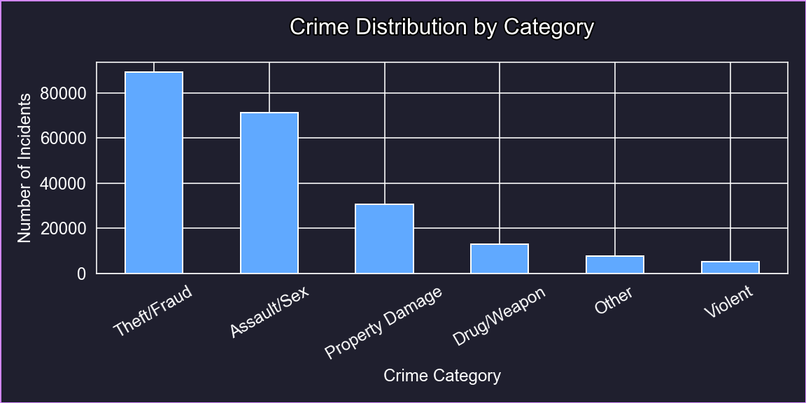
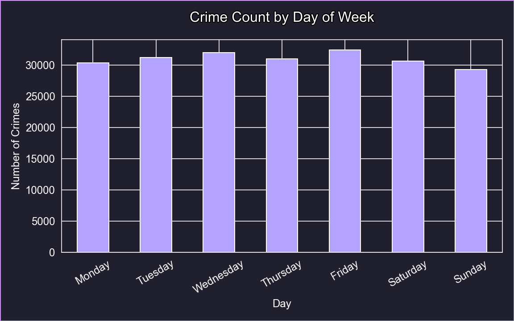
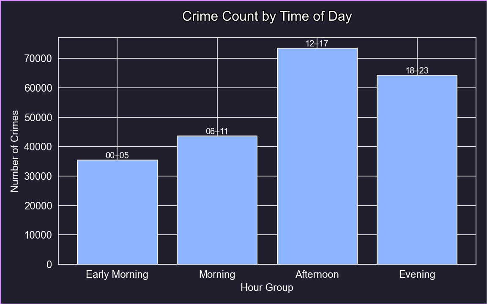
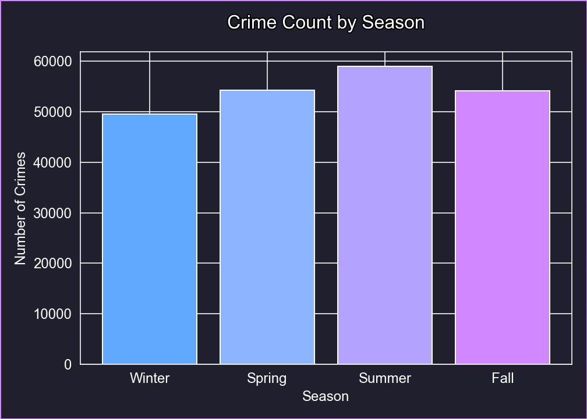
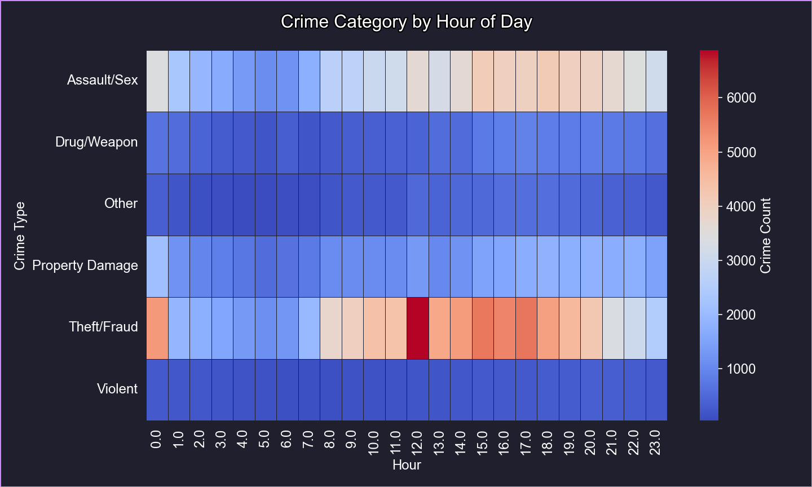
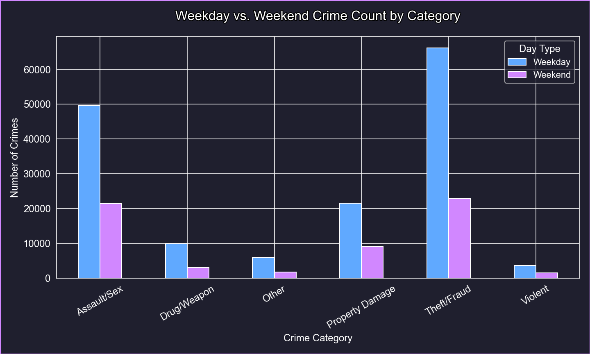
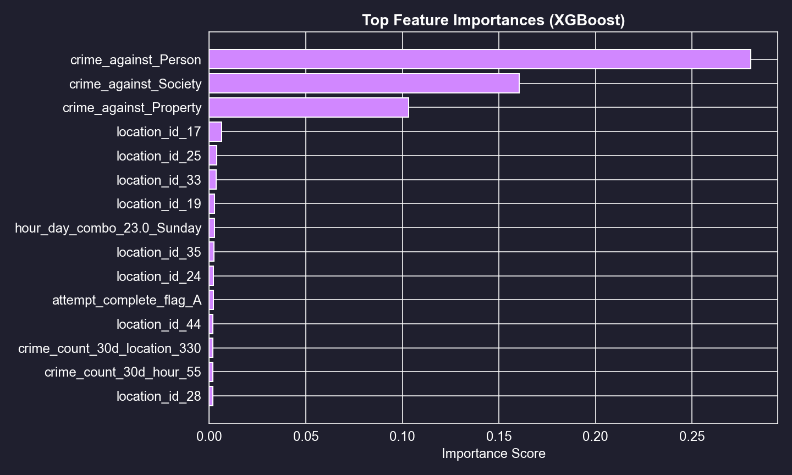
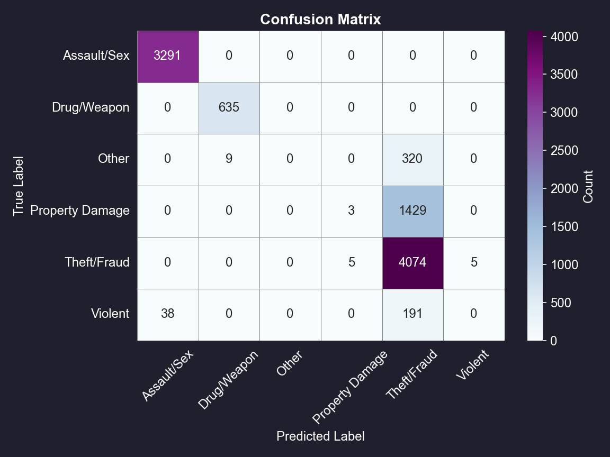

# NY Crime Detective: Analyzing and Predicting Crime Patterns in New York State

**Advanced Policy Analysis — Final Project**  
**Hana Alyahya**

---

## 1. Project Overview

Crime impacts not just public safety, but also housing markets, urban development, local economies, and overall public trust.  
However, decision-makers often lack timely insights into where, when, and what types of crimes are happening — until it’s too late.

**NY Crime Detective** aims to address that gap by building a predictive model to classify crime types and uncover meaningful behavioral patterns across New York State.

The project analyzes crime patterns from 2021 to 2023 using open data sources to uncover trends, identify high-crime areas, and explore the relationship between different types of crimes, locations, and times. The analysis also supports future predictive modeling efforts.

By leveraging big data analytics techniques, this project provides insights to support community safety efforts and policy recommendations.

---

## 2. Project Goals

- **Predict Crime Type**  
Develop a machine learning model that classifies reported crimes into broad categories.

- **Learn Crime Behavior**  
Extract meaningful features from time, location, and past trends to reveal how different crimes behave over hours, days, and seasons.

- **Support Decision-Making**  
Provide actionable insights to assist public safety planning and proactive interventions.

---

## 3. Dataset Overview

| Data Source | FBI NIBRS crime data — New York State Open Data Portal |
|--------|-------------------------------------------------------|
| Time Period | 2021 to 2023 |
| Size | ~1 million rows (after cleaning and merging) |
| Structure | Incident data merged with offense and offense type data |

---

## 4. Model Overview

An **XGBoost Classifier** was used because of its performance with large datasets, support for imbalanced classes, regularization, and feature importance scores.

**Feature Engineering included**:
- Temporal features: hour, day of week, season.
- Contextual features: location ID, crime against category, completion status.
- Smart features: past crime counts at locations and time-based windows.

Crime types were grouped into six categories: Theft/Fraud, Assault/Sex Crimes, Property Damage, Drug/Weapon, Violent Crimes, and Other.

The model achieved **80% accuracy** on the test set.

---

## 5. Results Summary

The analysis revealed several important patterns related to crime trends across New York State between 2021 and 2023:

### Figure 1. Crime Distribution by Category
  
*As shown in Figure 1, Theft/Fraud crimes were the most frequent, followed by Assault/Sex crimes and Property Damage incidents. Other categories like Drug/Weapon and Violent crimes were less common.*

### Figure 2. Crime Count by Day of the Week
  
*As illustrated in Figure 2, crime activity was highest on Wednesdays and Fridays, while Sundays consistently recorded the lowest number of crimes.*

### Figure 3. Crime Count by Time of Day
  
*Since crime patterns changed across the days of the week, it was also important to examine how crime levels shift during different times of the day. This helped identify when crime is most likely to occur within a 24-hour period. As shown in Figure 3, the afternoon period (12 PM to 5 PM) experienced the highest concentration of crimes, whereas early morning hours (midnight to 5 AM) had the lowest.*

### Figure 4. Crime Count by Season
  
*Understanding daily time patterns also raised the question of whether crime levels vary across different seasons, as external factors like weather and public activity levels change throughout the year. Figure 4 shows that summer recorded the highest number of crimes, followed by spring and fall, with winter showing the lowest crime rates.*

### Figure 5. Crime Patterns by Hour and Category
  
*Given the strong seasonal variations, it became important to further explore how different crime types behave throughout the day. This deeper analysis would reveal whether specific types of crimes peak at certain hours. As seen in Figure 5, the heatmap highlights that Theft/Fraud and Assault/Sex crimes peak during afternoon hours, while property damage incidents are more evenly distributed throughout the day.*

### Figure 6. Weekday vs. Weekend Crime Counts
  
*After understanding hourly patterns for different crime types, the next step was to compare crime frequency between weekdays and weekends, as lifestyle changes between these periods could influence crime behavior. Figure 6 demonstrates that crimes, especially Assault/Sex and Theft/Fraud, were more frequent on weekdays compared to weekends.*

---

Overall, the analysis revealed that crime incidents are strongly influenced by time and seasonality. Nearly half of all crimes occur during the afternoon hours, highlighting important time-based trends that can guide resource allocation strategies. In addition, crime activity tends to peak midweek, particularly on Wednesdays and Fridays, rather than on weekends, challenging common assumptions about when crimes are most likely to occur. Seasonal effects were also significant, with substantially higher crime rates recorded during the summer months compared to winter, underscoring the role of environmental and social factors in crime patterns.

---

## 6. Feature Importance

### Figure 7. Top Features
  
*Top predictive features included crime against category, recent crime counts at the same location, and time-based factors.*

---

## 7. Model Evaluation

### Figure 8. Confusion Matrix
  
*The confusion matrix showed the model performed best for Theft/Fraud and Assault/Sex categories. Some confusion occurred between Property Damage and Drug/Weapon crimes.*

---

## 8. Running the Project
To reproduce the results or run the project:

1. Clone this repository and ensure all required dependencies are installed (see `requirements.txt` or the Colab notebook).
2. Run the provided scripts to process the raw data and generate the necessary files (`combined_data.pkl`, `train_test_data.joblib`, etc.).
   
   > **Note:** Due to file size restrictions, large files (such as `combined_data.pkl` and `train_test_data.joblib`) are not included in this repository. However, they will be automatically created when running the scripts with the available raw data.

3. Alternatively, you can use the provided Google Colab notebook (`NY Crime Detective.ipynb`) included in this repository to run the entire workflow in a cloud environment without local setup.

If you encounter any issues or need access to the pre-generated large files, please contact the project owner.
---

## 9. Repository Structure

```
NY Crime Detective/
├── NY Crime Detective.ipynb      # Google Colab notebook
├── NY Crime Detective.pdf        # Exported notebook (PDF)
├── README.md
├── requirements.txt
├── cleaned_data.pkl
├── crime_smart_features.csv
├── data_clean.py
├── data_load.py
├── eda.py
├── encoder.joblib
├── environment_setup.py
├── evaluation.py
├── feature_engineering.py
├── label_encoder.joblib
├── modeling.py
├── utilities.py
├── xgb_final_model.joblib
├── data/                         # Raw data files
│
├── tmp_data/                     # Temporary data
│
├── visualizations/               # Generated visualizations
│
└── __pycache__/                  # Python cache
```


## 10. Scripts Overview

| Script | Purpose |
|--------|---------|
| `data_load.py` | Loads the raw crime data. |
| `data_clean.py` | Cleans and preprocesses the data. |
| `eda.py` | Performs exploratory data analysis and generates visualizations. |
| `feature_engineering.py` | Creates enhanced features to improve model performance. |
| `modeling.py` | Builds and evaluates machine learning models. |
| `evaluation.py` | Calculates metrics and interprets model results. |
| `environment_setup.py` | Sets up the required Python environment. |
| `utilities.py` | Contains helper functions used across scripts. |
| `NY Crime Detective.ipynb` | Complete workflow in Google Colab (data prep → EDA → modeling → results). |

---
## 11. Installation & Dependencies

```bash
conda install -c conda-forge xgboost
```

Or:

```bash
pip install xgboost pandas numpy tqdm matplotlib seaborn scikit-learn joblib
```

---

## 12. References

1. Federal Bureau of Investigation. National Incident-Based Reporting System (NIBRS) Data. New York State Open Data Portal, 2021–2023.
2. Chen, Tianqi, and Carlos Guestrin. “XGBoost: A Scalable Tree Boosting System.” Proceedings of the 22nd ACM SIGKDD International Conference on Knowledge Discovery and Data Mining, 2016.

---

## 13. Full Report

For complete methodology, results, and policy recommendations, refer to **Hana_Alyahya_Final_Report.pdf** included in this repository.
